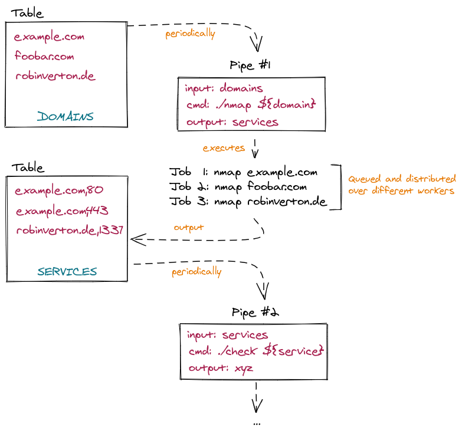

# pipers, a file-based task automation toolkit for monitoring

Define tasks in yaml files and chain them asynchronously. This is a powerfull way
to glue your tools together in a simple and efficient way. By using unique identifiers
for each record, it is possible to monitor for new records or changes.

Each task is called a *pipe* because you can pipe your tasks together to create
whole workflows.

## Concept

* each *pipe* is defined in a `yml` file, takes an (filtered) input and returns an output (string or json)
* each input to a pipe is passed to a system command, each output is then returned and persisted
* each output specifies an `ident`, so new changes can be detected

Example: The pipe with the name *http_detect* takes *domains* as input, passes them to *httpx* and persists the results:

```yaml
name: http_detect

input:
  table: domains

cmd: echo ${.input.asset} | httpx -silent -json -response-in-json

output:
  table: services
  ident: ${.outputJson.url}|${index .outputJson "status-code"}
  data:
    service: http
    webserver: ${.outputJson.webserver}
    url: ${.outputJson.url}
    title: ${.outputJson.title}
    status: ${index .outputJson "status-code"}

interval: 24h
timeout: 10m
worker: 10
```



## Features

* Scalable, all tasks are queued (over redis), each pipe can define how many workers are started
* Perodic/timed scanning (how often should each row be re-queued)
* Task uniqueness guaranteed (same task/pipe + data cant be executed at the same time twice)
* IP blacklist checks (private IPs and special networks)
* Pipe filtering through javascript
* Exclude assets by setting the `exclude` field

## Installation

* Install redis and postgres
* `go build`

## Configuration and Usage

A `.env` file is used for basic config stuff:

```
DATABASE_URL="database=pipers"
SLACK_WEBHOOK="https://hooks.slack.com/services/XXX/YYY"
```

The database schema is created automatically.

There are three modes which can be run:

### Scheduler

This will load all pipes from `./resources/pipes/*.yml` and periodically schedule
all due tasks.

```
./pipers
```

### Worker 

Using the `-worker` flag will load all pipes from `./resources/pipes/*.yml` and run
multiple workers for each pipe. The amount of each workers for each pipe is defined
in the pipe itself via the `worker` field.

```
./pipers -worker
```

### No-DB

Using this mode no database will be used and data (asset) is loaded from stdin.
This allows to debug pipes and print the result.

```
./pipers -noDb
```

### Additional usefull flags and options

* `-single pipe/to/load.yml` will load only a single pipe.
* To test a pipe in production, `debug: true` can be set in the yaml file so results are not saved in the database.

## Example setup and workflow

Let's install pipers, setup a simple workflow and add some initial data. Our example workflow should:

* enumerate domains
* detect http services
* discover content

This workflow will then run continuously and monitor for new assets/services/paths. 

### Setup simple subdomain enumeration

Let's begin with the first step in our chain, enumerating assets. We want to get all
"scope" domains from the domains table and pass it to a simple API retrieving subdomains.
For this we will define a simple *filter*, pass it to `curl` and put the parsed result in
a new table `output`.

The interval (how often this pipe should be run for each row) is set to 12h, while the
task will be cancelled after 1m. Additionally, an alert message can be defined which
is saved with the alert and used for notification hooks.

`./resources/pipes/domains_crobat.yml`
```yaml
name: domains_crobat
input:
  table: assets
  filter:
    scope: true
cmd: curl https://sonar.omnisint.io/subdomains/${.input.asset} -s | jq -r -c '.[]'
output:
  table: assets
  ident: ${.output}
  asset: ${.output}
interval: 12h
timeout: 1m
worker: 1
alert_msg: New domain '${.output}'
```

### Detecting HTTP services

Our second step in our chain is to detect http services on all domains found in the previous step(s).
Our `ident` is defined with the url and the status code. This results in new entries
as soon as a new service is found or the status code changes.

`./resources/pipes/http_detect.yml`
```yaml
name: http_detect

# load data from assets table
input:
  table: assets

# pipe asset into httpx
cmd: echo ${.input.asset} | httpx -json -response-in-json -ports=80,81,300,443,3128,8080,8081

filter:
  # example filter to remove cloudflare blocked entries
  waf: | var data = JSON.parse(output)
    data.response.includes('Sorry, you have been blocked') 

output:
  table: services
  ident: ${.outputJson.url}|${index .outputJson "status-code"}
  data:
    service: http
    webserver: ${.outputJson.webserver}
    url: ${.outputJson.url}
    title: ${.outputJson.title}
    response: ${.outputJson.serverResponse}
    status: ${index .outputJson "status-code"}

# alert message contains the url, title and server (from headers)
alert_msg: ${.outputJson.url} - TITLE '${.outputJson.title}' - SERVER ${.outputJson.webserver}

# run this pipe every 12h on every row from input table
interval: 12h

# cancel task after httpx runs for more than 10m
timeout: 10m

# run 10 workers for this pipe
worker: 10
```

### Discover content

`./resources/pipes/http_content.yml`
```yaml
name: http_content

input:
  table: services
  filter:
    service: http

# pipe asset into httpx
cmd: ./discover_content ${.input.asset}

output:
  table: content
  ident: ${.outputJson.url}
  data:
    url: ${.outputJson.url}
    title: ${.outputJson.title}
    response: ${.outputJson.serverResponse}
    status: ${index .outputJson "status-code"}

interval: 12h
timeout: 10m
worker: 10

```

### Starting it

First start the scheduler:

`./pipers`

and then also start all workers:

`./pipers -worker`.

### Adding initial targets (TODO)

The recommended way to do this is to use a DB browser. The following SQL queries
will add three scope domains for a target with the name *example*:

```sql
INSERT INTO domains (ident, asset, target, data) values ('example.com','example.com', 'example', '{"scope": true}');
INSERT INTO domains (ident, asset, target, data) values ('example2.com','example2.com', 'example', '{"scope": true}');
INSERT INTO domains (ident, asset, target, data) values ('example3.com','example3.com', 'example', '{"scope": true}');
```

The previously started scheduler will pick this entries up automatically and queue them for processing.

### Excluding assets

It is possible to exclude assets (and subdomains) by setting the exclude flag in the `domains` table to `true`.

Example to exclude `foo.bar.com` (and all subdomains of this domain):

```sql
INSERT INTO domains (ident, asset, target, exclude) values ('example.com','example.com', 'example', true);
```

